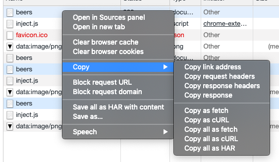
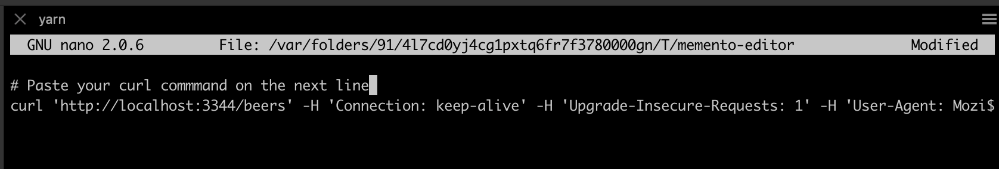

[](https://travis-ci.org/antoinechalifour/memento) [](https://codecov.io/gh/antoinechalifour/memento)

<p align="center">
  <h1 align="center">Memento</h3>
  <p align="center">Memento is a <strong>development-only</strong> tool that caches HTTP calls once they have been executed</p>
</p>

<div align="center"></div>

## Why should one use Memento?

When building a UI or working on any project that rely on external services, some things can slow us down:

- the API **may not be stable** at the moment
- the API **may apply harsh rate-limiting** (and that's terrible if you forget the dependency array in your `React.useEffect` 😉)
- ...or you may be working on a train or plane where **the network is not reliable**.

**Memento has been built to solve these problems.**

Memento acts as a development buddy that remembers the requests that your application is sending, the server response, and will respond to your app without the need for requests to go over the internet.

_Pro-tip: Memento may also be used for [stubbing external services for integration or end-to-end testing](./examples/stub-external-services) 🎉_

## Getting started

**1. Add a Memento configuration file**

To add Memento to your project, you need to add a `.mementorc` file to your project root.

_Note: you may use any other configuration file supported by [cosmiconfig](https://github.com/davidtheclark/cosmiconfig)._

The most basic configuration file to cache the [PunkApi](https://punkapi.com/documentation/v2) would look something like this:

```json
{
  "targetUrl": "https://api.punkapi.com/v2"
}
```

**2. Target the endpoint**

You will then need to configure your app to target `http://localhost:3344` as the API url.

_Note: this should only be done at development time, do not target localhost for your production build!_

**3. Run Memento**

You can then run Memento using `npx @antoinechalifour/memento`.

_Note: `npx` is a command that comes with `npm` when installing Node and enables users to run binaries without installing them manually._

## Options

The following options are supported:

| Option                 | Description                                                   | Example                                                | Default value  |
| ---------------------- | ------------------------------------------------------------- | ------------------------------------------------------ | -------------- |
| targetUrl              | The API base URL                                              | http://localhost:4000                                  | None           |
| port                   | The port used to launch Memento                               | 9876                                                   | 3344           |
| cacheDirectory         | The cache directory used for storing responses                | memento-integration                                    | .memento-cache |
| useRealResponseTime    | Whether Memento should respond using the actual response time | true                                                   | false          |
| disableCachingPatterns | An array of patterns used to ignore caching certain requests  | [{ method: 'post', urlPattern: '/pokemon/*/sprites' }] | []             |
| ignoreCookiesPattern   | A regular expression for ignoring cookies                     | AMP_TOKEN\|_ga.*\|_gid                                 | null           |

### Option: disableCachingPatterns

You may use `disableCachingPatterns` in your configuration to tell Memento to ignore caching responses based on the request method and URL. As an example, if you wish to not cache routes likes `/pokemon/mew/abilities` and `pokemon/ditto/abilities`, you may use the following configuration :

```
{
  // ... your configuration
  "disableCachingPatterns": [{
    "method": "GET",
    "urlPattern": "/pokemon/*/abilities"
  }]
}
```

The [minimatch](https://www.npmjs.com/package/minimatch) package is used for comparing glob patterns and the actual url. You may use a tool like [globtester](http://www.globtester.com) to test your configurations.

#### Recipe: ignore caching all POST requests

```
{
  // ... your configuration
  "disableCachingPatterns": [{
    "method": "post",
    "urlPattern": "**"
  }]
}
```

### Option: ignoreCookiesPattern

Even though Memento play well with stateless APIs, you may want to use it against APIs which use cookies. This might be tricky if the server always sets different cookies (thus cached requests cannot be replayed as the change every time they are made).

Memento provides an `ignoreCookiesPattern` which allows you to tell Memento not to care about cookies that match the regular expression that you provided.

*Note: you may use [Regexr](https://regexr.com/) to test your configuration.*

*Note: as Memento runs over HTTP, secure cookies will be downgraded to normal cookies.*

### Recipe: ignore Google Analytics cookies

A common use case is ignoring Google Analytics cookies : `_ga`, `_gid`, `_gat`, `_gac-*`, `AMP_TOKEN`. The following configuration tells Memento to ignore such cookies:

```
{
  // ... your configuration
  "ignoreCookiesPattern": "AMP_TOKEN|_ga.*|_gid"
}
```

## Examples

- [Usage with Create React App](./examples/create-react-app)
- [Stubbing external services for integration tests](./examples/stub-external-services)

## Using the CLI

Launching Memento will start the interactive Memento CLI, where you can type commands to modify the cached requests and responses. The documentation can be found by typing `help` in the command prompt.


### Command: import

You may import cURL commands into Memento. This feature is intended to be used as such:

1. develop your app like the API is ready
2. open the "network" tab in the Chrome devtools
3. right click the failed request and select "copy as cURL"

   

4. use the "import" command in memento and paste the cURL command.

   

5. you can now edit the response in your editor to stub the API call 🎉

**Note: Memento will open the editor defined in your EDITOR environment variable. Non-terminal editors are not supported.**

## Cache location

By default, memento will create a `.memento-cache` directory in the current directory where each response will be mapped to a directory containing:

- `metadata.json` - A file containing information about the request and the response.
- `body.{json,xml,txt}` - The response content. The extension depends on the response `content-type` header. You may edit this file to edit the response.

You may override this directory by providing a `cacheDirectory` in the configuration file. this may be useful for storing environment dependent responses.

## Contributing

Below is a list of commands you will probably find useful.

```
# Start TS compilation in watch mode
yarn start

# Start the local server
yarn dev
```
